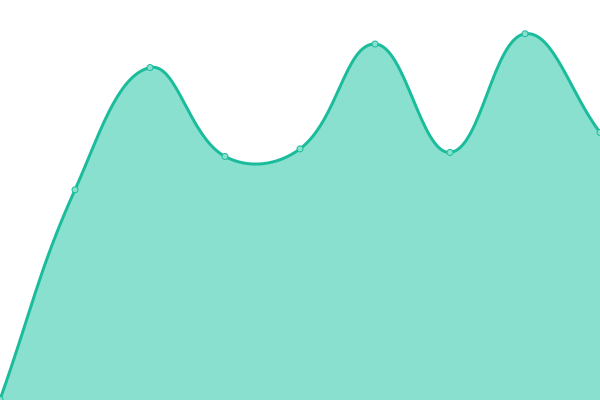

# [📈 Live Status](https://smb.github.io/mon-ff): <!--live status--> **🟩 All systems operational**

This repository contains the open-source uptime monitor and status page for [Steffen](https://smb.github.io/mon-ff), powered by [Upptime](https://github.com/upptime/upptime).

With [Upptime](https://upptime.js.org), you can get your own unlimited and free uptime monitor and status page, powered entirely by a GitHub repository. We use [Issues](https://github.com/smb/mon-ff/issues) as incident reports, [Actions](https://github.com/smb/mon-ff/actions) as uptime monitors, and [Pages](https://smb.github.io/mon-ff) for the status page.

<!--start: status pages-->
<!-- This summary is generated by Upptime (https://github.com/upptime/upptime) -->
<!-- Do not edit this manually, your changes will be overwritten -->
<!-- prettier-ignore -->
| URL | Status | History | Response Time | Uptime |
| --- | ------ | ------- | ------------- | ------ |
|  [Stefanie-Braun.de](https://www.stefanie-braun.de) | 🟩 Up | [stefanie-braun-de.yml](https://github.com/smb/mon-ip/commits/HEAD/history/stefanie-braun-de.yml) | 

 1326ms
     
 | 

<a href="https://smb.github.io/mon-ip/history/stefanie-braun-de">100.00%</a>
    

|  [Fabula-Fantastica](https://fabula-fantastica.online) | 🟩 Up | [fabula-fantastica.yml](https://github.com/smb/mon-ip/commits/HEAD/history/fabula-fantastica.yml) | 

 651ms
     
 | 

<a href="https://smb.github.io/mon-ip/history/fabula-fantastica">100.00%</a>
    

|  [Fabula-Fantastica - SWTOR](https://swtor.fabula-fantastica.online) | 🟩 Up | [fabula-fantastica-swtor.yml](https://github.com/smb/mon-ip/commits/HEAD/history/fabula-fantastica-swtor.yml) | 

 619ms
     
 | 

<a href="https://smb.github.io/mon-ip/history/fabula-fantastica-swtor">100.00%</a>
    

|  [Fabula-Fantastica - MDZS](https://mdzs.fabula-fantastica.online) | 🟩 Up | [fabula-fantastica-mdzs.yml](https://github.com/smb/mon-ip/commits/HEAD/history/fabula-fantastica-mdzs.yml) | 

 609ms
     
 | 

<a href="https://smb.github.io/mon-ip/history/fabula-fantastica-mdzs">100.00%</a>
    

|  [Geschmacksache](https://www.geschmacksache.online) | 🟩 Up | [geschmacksache.yml](https://github.com/smb/mon-ip/commits/HEAD/history/geschmacksache.yml) | 

 1990ms
     
 | 

<a href="https://smb.github.io/mon-ip/history/geschmacksache">100.00%</a>
    

<!--end: status pages-->

[**Visit our status website →**](https://smb.github.io/mon-ff)

## 📄 License

- Powered by: [Upptime](https://github.com/upptime/upptime)
- Code: [MIT](./LICENSE) © [Steffen](https://smb.github.io/mon-ff)
- Data in the `./history` directory: [Open Database License](https://opendatacommons.org/licenses/odbl/1-0/)
